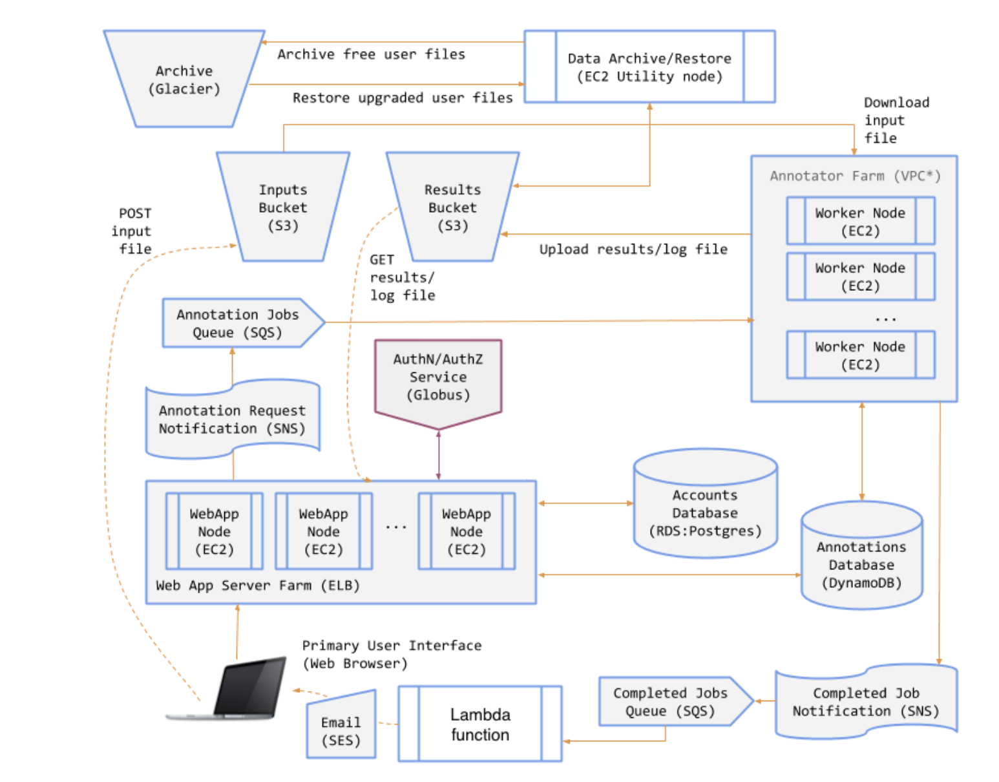

# Genomics Annotation Service (GAS)
This cloud computing project builds a `SaaS` for a `genomics annotation service` (short as 'GAS'). Users can log in on the website, submit genomics related files for annotation, and download the result files once the annotation is completed. Glacier is utilized for result files to archive if the user is not a premium user, and the users can upgrade and downgrade to and from premium users according their needs. In the very end, the project is realized in a distributed system manner and uses a load balancer that allows scaling up and down based on the ongoing annotation workload. The main tool being used is `Flask` and `Boto3`. The cloud resource provider is `AWS`.
* This project primarily serves as a final project for University of Chicago MPCS course.
* Author: Alexandra (Siyuan) Qi
[GitHub Profile](https://github.com/rhythm0)
  
# Demo
A demo for the key processes: 
* `Premium user` login through Globus, having access to view and download history annotation result files.
* Unsubscribe and downgrade to `Free user`, losing access to view history annotation result file.
* Subscribe to Premium Plan, history result files being restored through Glacier.
* Submit an annotation job, view the job results in the annotation lists.

## Key Functions
When completed, the GAS will allow a user to perform the following functions:
* `Log in (via Globus Auth) to use the service` -- Some aspects of the service are available only to registered users. Two classes of users will be supported: Free and Premium. Premium users will have access to additional functionality, beyond that available to Free users.
* `Upgrade from a Free to a Premium user` -- Users will be able to upgrade from Free to Premium. (Previously this required a mock credit card payments integration, but we have removed that.)
* `Submit an annotation job` -- Free users may only submit jobs of up to a certain size. Premium users may submit any size job. If a Free user submits an oversized job, the system will refuse it and will prompt the user to convert to a Premium user.
* `Receive notifications when annotation jobs finish` -- When their annotation request is complete, the GAS will send users an email that includes a link where they can view the log file and download the results file.
* `Browse jobs and download annotation results` -- The GAS will store annotation results for later retrieval. Users may view a list of their jobs (completed and running). Free users may download results up to 10 minutes after their job has completed; thereafter their results will be archived and only available to them if they convert to a Premium user. Premium users will always have all their data available for download.

## System Components
The GAS will comprise the following components:
* An object store for input files, annotated (result) files, and job log files.
* A key-value store for persisting information on annotation jobs.
* A low cost, highly-durable object store for archiving the data of Free users.
* A relational database for user account information.
* A service that runs AnnTools for annotation.
* A web application for users to interact with the GAS.
* A set of message queues and notification topics for coordinating system activity.
The diagram below shows the various GAS components/services and interactions:

# gas-framework
An enhanced web framework (based on [Flask](http://flask.pocoo.org/)) for use in the capstone project. Adds robust user authentication (via [Globus Auth](https://docs.globus.org/api/auth)), modular templates, and some simple styling based on [Bootstrap](http://getbootstrap.com/).

Directory contents are as follows:
* `/web` - The GAS web app files
* `/ann` - Annotator files
* `/util` - Utility scripts for notifications, archival, and restoration
* `/aws` - AWS user data files
* `/src` - All other sources

Specific instructions on the project are located in the README.md files in each directory.
